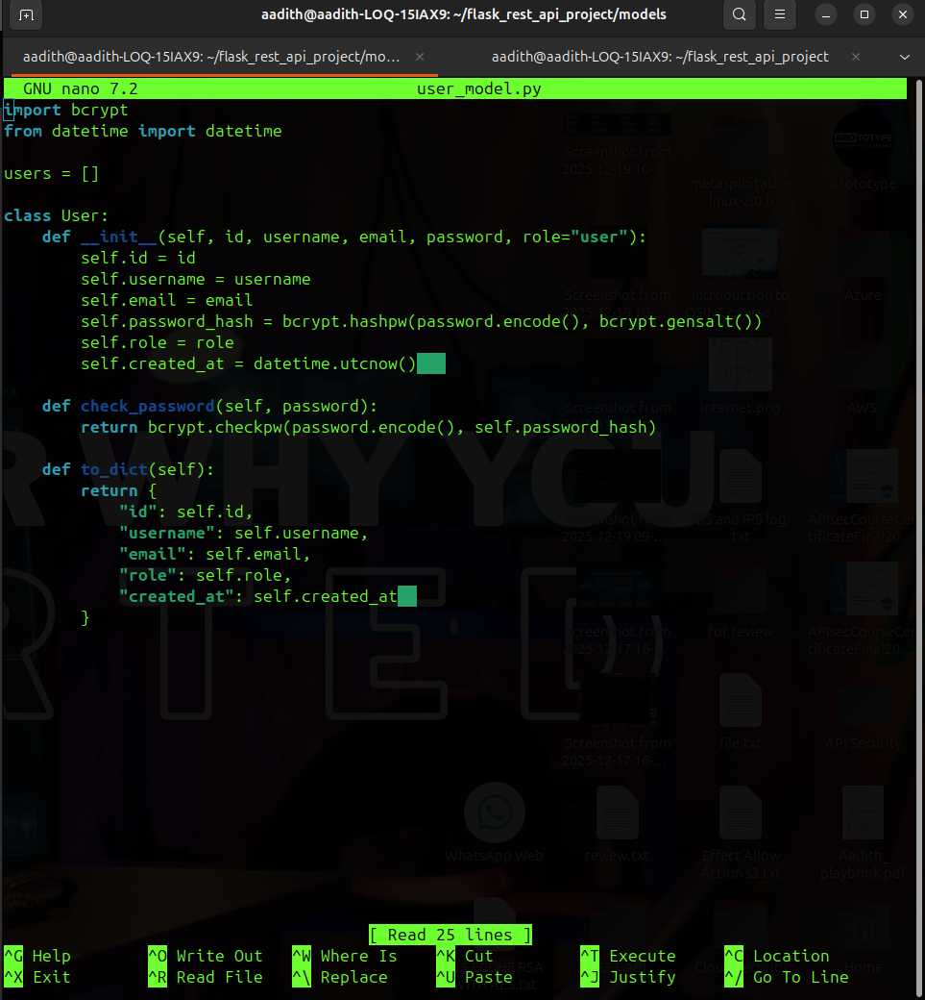
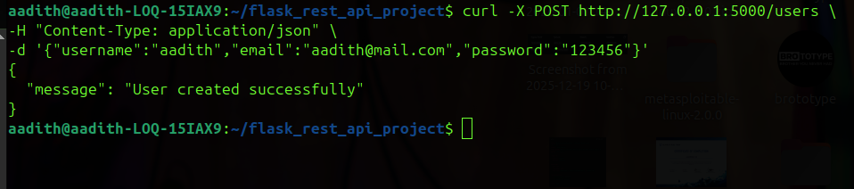
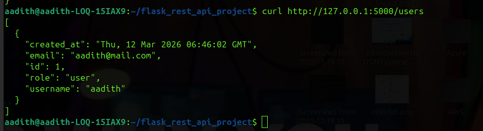
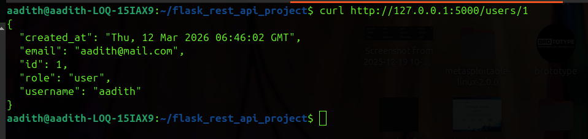
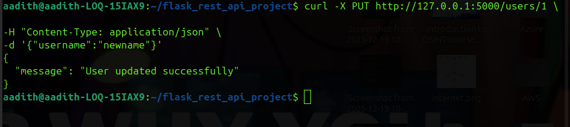
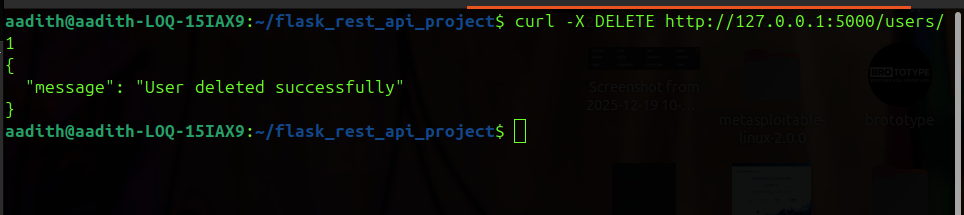

# Flask REST API Project -- User Model and CRUD Implementation

## 4. User Model Design

### Overview

The **User model** represents user data stored in the system. It
contains fields used for identification, authentication, authorization,
and record tracking.

  Field           Description
  --------------- -----------------------------------------------------
  id              Unique identifier for each user
  username        Username of the user
  email           Email address of the user
  password_hash   Password securely stored using bcrypt hashing
  role            Role of the user (e.g., user or admin)
  created_at      Timestamp showing when the user account was created

### User Model Implementation

File location:

`models/user_model.py`

``` python
import bcrypt
from datetime import datetime

users = []

class User:
    def __init__(self, id, username, email, password, role="user"):
        self.id = id
        self.username = username
        self.email = email
        self.password_hash = bcrypt.hashpw(password.encode(), bcrypt.gensalt())
        self.role = role
        self.created_at = datetime.utcnow()

    def check_password(self, password):
        return bcrypt.checkpw(password.encode(), self.password_hash)

    def to_dict(self):
        return {
            "id": self.id,
            "username": self.username,
            "email": self.email,
            "role": self.role,
            "created_at": self.created_at
        }
```




------------------------------------------------------------------------

## 5. CRUD API Implementation

The application implements **CRUD operations** for managing user
resources.

  Method   Endpoint               Description
  -------- ---------------------- --------------------------
  POST     /users                 Create a new user
  GET      /users                 Retrieve all users
  GET      /users/`<id>`{=html}   Retrieve a specific user
  PUT      /users/`<id>`{=html}   Update user details
  DELETE   /users/`<id>`{=html}   Delete a user

------------------------------------------------------------------------

## 6. API Endpoint Documentation

### 6.1 Create User

**Endpoint** POST /users

**Request Example**

``` json
{
  "username": "aadith",
  "email": "aadith@mail.com",
  "password": "123456"
}
```

**Response Example**

``` json
{
  "message": "User created successfully"
}
```

**HTTP Status Code** 201 Created



------------------------------------------------------------------------

### 6.2 Retrieve All Users

**Endpoint** GET /users

**Example Request**

``` bash
curl http://127.0.0.1:5000/users
```

**Response Example**

``` json
[
  {
    "id": 1,
    "username": "aadith",
    "email": "aadith@mail.com",
    "role": "user"
  }
]
```


------------------------------------------------------------------------

### 6.3 Retrieve a Specific User

**Endpoint** GET /users/1

**Response Example**

``` json
{
  "id": 1,
  "username": "aadith",
  "email": "aadith@mail.com",
  "role": "user"
}
```



------------------------------------------------------------------------

### 6.4 Update User

**Endpoint** PUT /users/1

**Example Request**

``` bash
curl -X PUT http://127.0.0.1:5000/users/1 \
-H "Content-Type: application/json" \
-d '{"username":"newname"}'
```

**Response**

``` json
{
  "message": "User updated successfully"
}
```


------------------------------------------------------------------------

### 6.5 Delete User

**Endpoint** DELETE /users/1

**Response**

``` json
{
  "message": "User deleted successfully"
}
```


------------------------------------------------------------------------

## 7. Testing

All endpoints were tested using **curl commands in the terminal**.\
The responses confirmed that the REST API successfully handled:

-   User creation
-   User retrieval
-   Updating user data
-   Deleting users

The Flask server logs confirmed successful request processing with
appropriate HTTP status codes.
