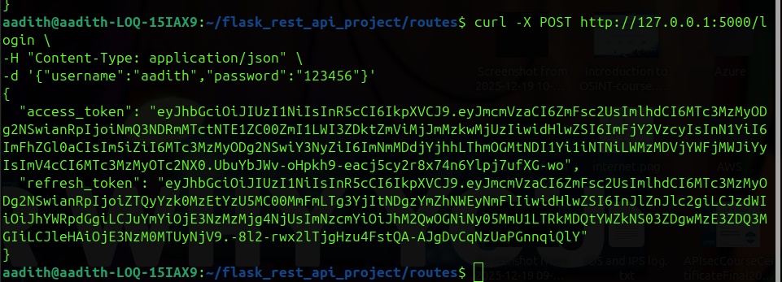
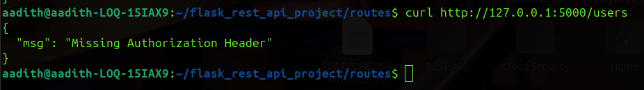
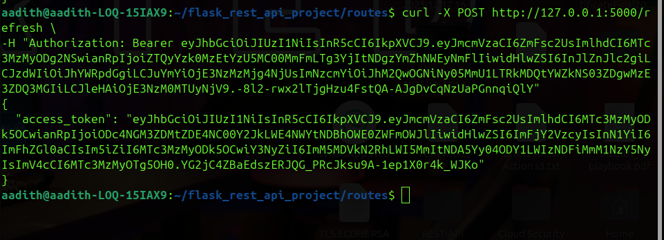
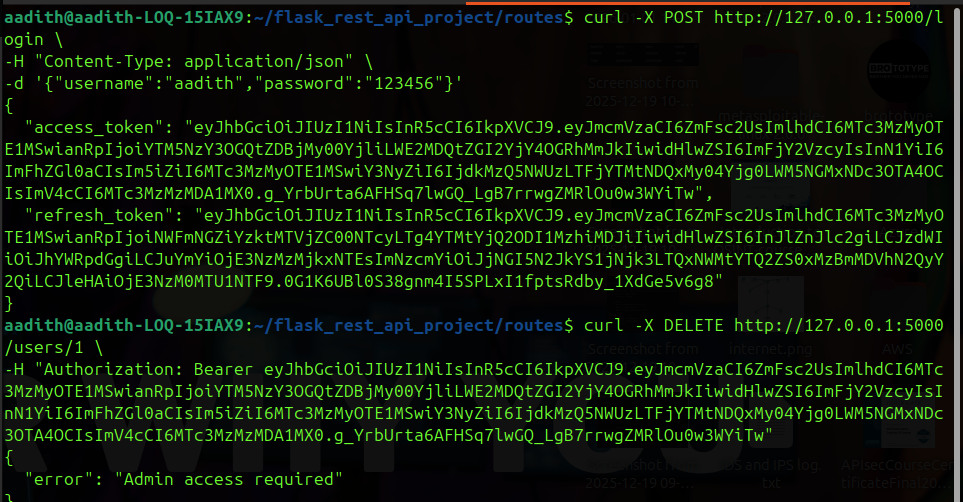

# Authentication and Authorization using JWT

## Introduction

Authentication and authorization are essential components of API
security. Authentication verifies the identity of a user, while
authorization determines what actions the user is allowed to perform.

In this project, JSON Web Tokens (JWT) are used to implement secure
authentication for a Flask REST API. After successful login, the server
generates a token which the client includes in future requests to access
protected endpoints.

This system includes:

-   User registration
-   User login
-   Access token generation
-   Refresh token mechanism
-   Protected API routes
-   Role-Based Access Control (RBAC)

------------------------------------------------------------------------

# JWT Authentication Workflow

1.  User registers using `/register`.
2.  User logs in using `/login`.
3.  Server validates username and password.
4.  Server generates:
    -   Access Token
    -   Refresh Token
5.  Client stores tokens.
6.  Client sends access token in Authorization header.
7.  Server validates token before granting access.
8.  Refresh token can generate a new access token when the old one
    expires.

------------------------------------------------------------------------

# User Registration

### Endpoint

POST /register

### Example Request

``` bash
curl -X POST http://127.0.0.1:5000/register -H "Content-Type: application/json" -d '{"username":"aadith","email":"aadith@mail.com","password":"123456"}'
```

### Example Response

``` json
{
 "message": "User registered successfully"
}
```


------------------------------------------------------------------------

# User Login and Token Generation

### Endpoint

POST /login

### Example Request

``` bash
curl -X POST http://127.0.0.1:5000/login -H "Content-Type: application/json" -d '{"username":"aadith","password":"123456"}'
```

### Example Response

``` json
{
 "access_token": "...",
 "refresh_token": "..."
}
```

### Screenshot



------------------------------------------------------------------------

# JWT Implementation Code

### Login Route Example

``` python
from flask_jwt_extended import create_access_token, create_refresh_token

@auth_bp.route("/login", methods=["POST"])
def login():

    data = request.get_json()

    for user in users:
        if user.username == data["username"] and user.check_password(data["password"]):

            access_token = create_access_token(identity=user.username)
            refresh_token = create_refresh_token(identity=user.username)

            return jsonify({
                "access_token": access_token,
                "refresh_token": refresh_token
            })

    return jsonify({"error": "Invalid credentials"}), 401
```

------------------------------------------------------------------------

# Protected Endpoints

Private routes are protected using the `@jwt_required()` decorator.

Example:

``` python
from flask_jwt_extended import jwt_required

@user_bp.route("/users", methods=["GET"])
@jwt_required()
def get_users():
    return jsonify([user.to_dict() for user in users])
```

### Accessing Protected Endpoint

``` bash
curl http://127.0.0.1:5000/users -H "Authorization: Bearer ACCESS_TOKEN"
```

### Screenshot



------------------------------------------------------------------------

# Refresh Token Mechanism

Access tokens expire after a specific time for security. Refresh tokens
allow users to obtain a new access token without logging in again.

### Endpoint

POST /refresh

### Example Request

``` bash
curl -X POST http://127.0.0.1:5000/refresh -H "Authorization: Bearer REFRESH_TOKEN"
```

### Example Response

``` json
{
 "access_token": "new_access_token"
}
```

### Screenshot



------------------------------------------------------------------------

# Role-Based Access Control (RBAC)

RBAC restricts certain actions to specific user roles.

Example rule:

-   Admin → Can delete users
-   Normal user → Cannot delete users

### RBAC Implementation

``` python
from flask_jwt_extended import get_jwt_identity

@user_bp.route("/users/<int:id>", methods=["DELETE"])
@jwt_required()
def delete_user(id):

    current_user = get_jwt_identity()

    if current_user != "admin":
        return jsonify({"error": "Admin access required"}), 403
```

### Screenshot



------------------------------------------------------------------------

# Token Validation

When a request is sent with the Authorization header:

Authorization: Bearer TOKEN

Flask-JWT-Extended performs the following:

-   Decodes JWT token
-   Verifies signature
-   Checks expiration
-   Retrieves user identity
-   Allows access if valid

------------------------------------------------------------------------

# Conclusion

JWT-based authentication provides a secure way to protect API endpoints.
By implementing access tokens, refresh tokens, and RBAC, the API ensures
that only authorized users can access protected resources.

This implementation demonstrates a practical approach to securing REST
APIs using Flask and JWT.
