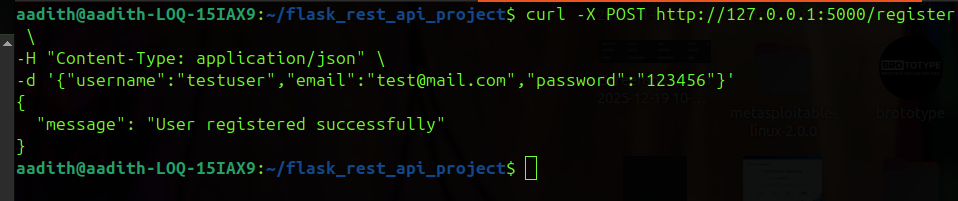
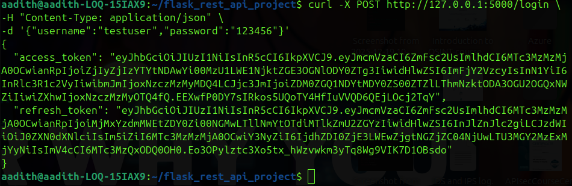
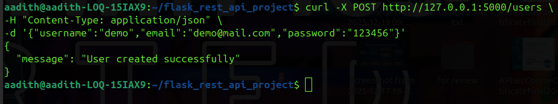
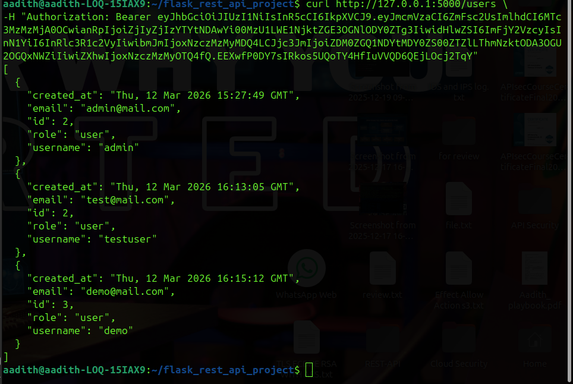
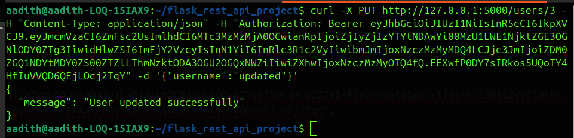
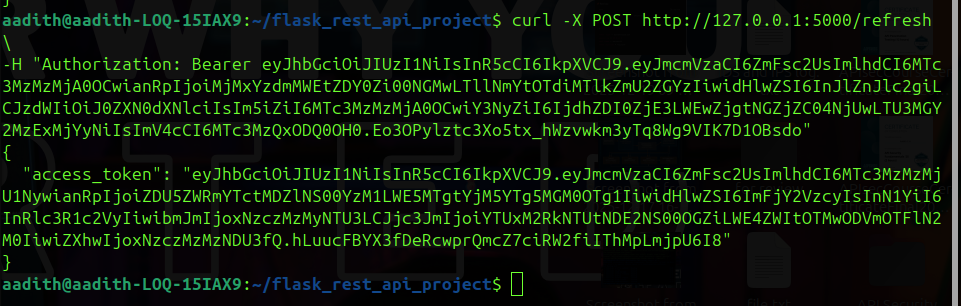
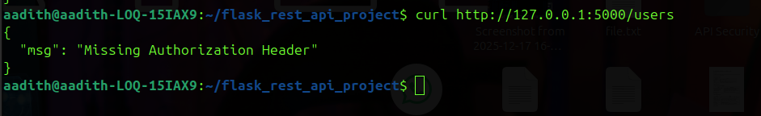
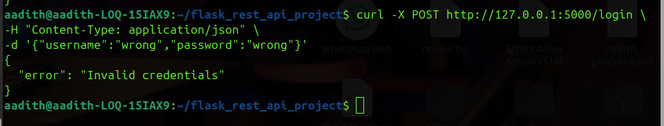

# Testing API Endpoints using curl

## Introduction

Testing API endpoints is an important part of API development to ensure that the system works correctly and securely. In this project, the REST API endpoints were tested using **curl commands in the terminal**. These tests validated CRUD operations, authentication mechanisms, token-based authorization, refresh tokens, and role‑based access control (RBAC).

The testing process also verified **error handling and edge cases** such as invalid credentials, missing authorization tokens, and unauthorized access attempts.

---

# 1. Testing Authentication Endpoints

## 1.1 User Registration

**Endpoint**

POST /register

**Example Request**

```bash
curl -X POST http://127.0.0.1:5000/register -H "Content-Type: application/json" -d '{"username":"testuser","email":"test@mail.com","password":"123456"}'
```

**Expected Response**

```json
{
 "message": "User registered successfully"
}
```

**Screenshot Placeholder**



---

## 1.2 User Login

**Endpoint**

POST /login

**Example Request**

```bash
curl -X POST http://127.0.0.1:5000/login -H "Content-Type: application/json" -d '{"username":"testuser","password":"123456"}'
```

**Expected Response**

```json
{
 "access_token": "...",
 "refresh_token": "..."
}
```

**Screenshot Placeholder**



---

# 2. Testing CRUD Endpoints

## 2.1 Create User

**Endpoint**

POST /users

**Example Request**

```bash
curl -X POST http://127.0.0.1:5000/users -H "Content-Type: application/json" -d '{"username":"demo","email":"demo@mail.com","password":"123456"}'
```

**Expected Response**

```json
{
 "message": "User created successfully"
}
```

**Screenshot Placeholder**



---

## 2.2 Retrieve Users

**Endpoint**

GET /users

**Example Request**

```bash
curl http://127.0.0.1:5000/users -H "Authorization: Bearer ACCESS_TOKEN"
```

**Expected Response**

```json
[
 {
  "id": 1,
  "username": "demo"
 }
]
```

**Screenshot Placeholder**



---

## 2.3 Update User

**Endpoint**

PUT /users/<id>

**Example Request**

```bash
curl -X PUT http://127.0.0.1:5000/users/3 -H "Content-Type: application/json" -H "Authorization: Bearer ACCESS_TOKEN" -d '{"username":"updated"}'
```

**Expected Response**

```json
{
 "message": "User updated successfully"
}
```

**Screenshot Placeholder**



---

## 2.4 Delete User (RBAC Protected)

**Endpoint**

DELETE /users/<id>

**Example Request**

```bash
curl -X DELETE http://127.0.0.1:5000/users/3 -H "Authorization: Bearer ACCESS_TOKEN"
```

**Possible Response for Normal User**

```json
{
 "error": "Admin access required"
}
```

**Screenshot Placeholder**


---

# 3. Refresh Token Testing

**Endpoint**

POST /refresh

**Example Request**

```bash
curl -X POST http://127.0.0.1:5000/refresh -H "Authorization: Bearer REFRESH_TOKEN"
```

**Expected Response**

```json
{
 "access_token": "new_access_token"
}
```

**Screenshot Placeholder**



---

# 4. Edge Case Testing

## 4.1 Missing Authorization Token

**Request**

```bash
curl http://127.0.0.1:5000/users
```

**Expected Response**

```json
{
 "msg": "Missing Authorization Header"
}
```

**Screenshot Placeholder**



---

## 4.2 Invalid Login Credentials

**Request**

```bash
curl -X POST http://127.0.0.1:5000/login -H "Content-Type: application/json" -d '{"username":"wrong","password":"wrong"}'
```

**Expected Response**

```json
{
 "error": "Invalid credentials"
}
```

**Screenshot Placeholder**



---

# 5. Validation of Request/Response Cycle

The tests confirm that:

- Valid requests return successful responses (200 / 201 status).
- Protected endpoints require JWT authentication.
- Invalid requests return appropriate error messages.
- Role-based restrictions prevent unauthorized operations.
- Refresh tokens generate new access tokens when required.

This confirms that the **API request and response cycle works correctly and handles errors securely**.

---

# 6. Conclusion

All API endpoints were successfully tested using curl commands. The testing verified:

- User registration and login functionality
- JWT authentication and authorization
- CRUD operations for user resources
- Refresh token generation
- Role-based access control restrictions
- Proper error handling for edge cases

These tests demonstrate that the REST API behaves correctly and follows secure API development practices.
