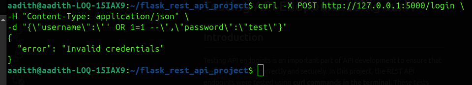
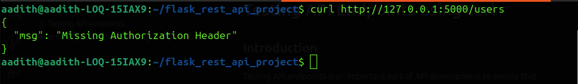
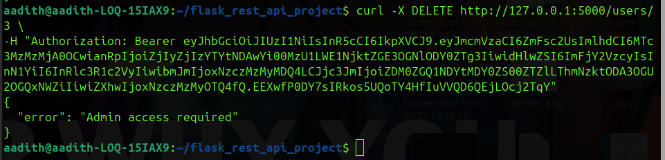
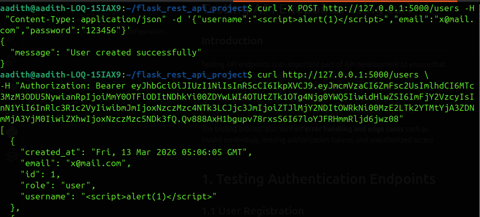
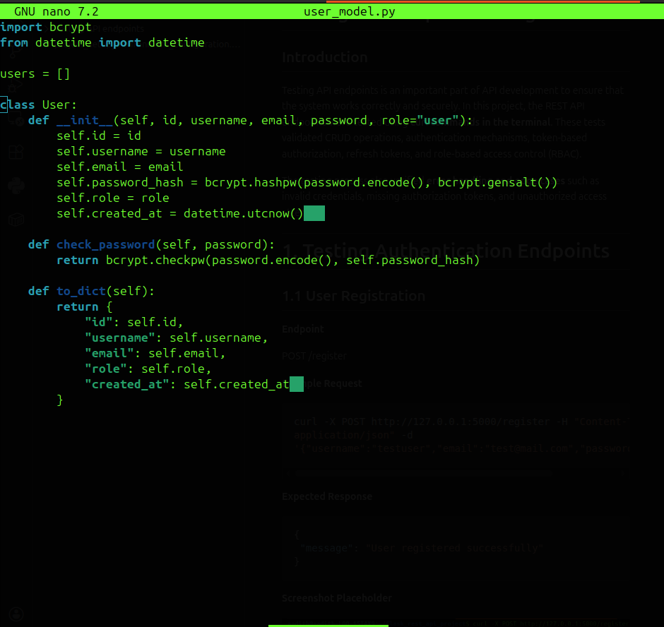
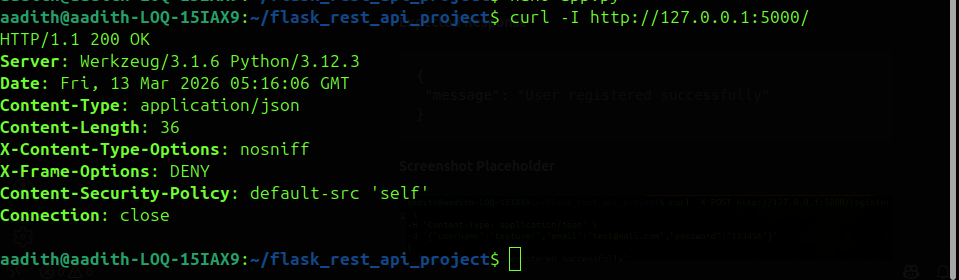

# Identifying and Mitigating Common API Vulnerabilities

## Introduction

Modern APIs are exposed to various security threats such as injection attacks, broken authentication, broken access control, cross-site scripting (XSS), and sensitive data exposure. To ensure the security of the developed Flask REST API, several vulnerability tests were performed and mitigation techniques were implemented.

The following sections describe the identified vulnerabilities, how they were tested, and the steps taken to mitigate them.

---

# Injection Attack

## Description

Injection attacks occur when malicious input is provided to manipulate application logic or database queries.

Example malicious payload:

```
' OR 1=1 --
```

## Test Performed

```bash
curl -X POST http://127.0.0.1:5000/login -H "Content-Type: application/json" -d '{"username":"\' OR 1=1 --","password":"test"}'
```

## Result

The API rejected the request and returned:

```json
{ "error": "Invalid credentials" }
```



## Mitigation

The API safely parses JSON input rather than executing raw queries.

```python
data = request.get_json()
username = data.get("username")
password = data.get("password")
```

---

# Broken Authentication

## Description

Broken authentication occurs when APIs fail to properly verify user identity.

## Test Performed

```bash
curl http://127.0.0.1:5000/users
```

## Result

```json
{ "msg": "Missing Authorization Header" }
```



## Mitigation

Protected endpoints require JWT authentication.

```python
@jwt_required()
```

---

# Broken Access Control (RBAC)

## Description

Broken access control allows users to perform operations they are not authorized to perform.

## Test Performed

```bash
curl -X DELETE http://127.0.0.1:5000/users/3 -H "Authorization: Bearer ACCESS_TOKEN"
```

## Result

```json
{ "error": "Admin access required" }
```



## Mitigation

```python
current_user = get_jwt_identity()

if current_user != "admin":
    return jsonify({"error": "Admin access required"}), 403
```

---

# Cross‑Site Scripting (XSS)

## Description

XSS occurs when malicious scripts are injected into applications.

Example payload:

```html
<script>alert(1)</script>
```

## Test Performed

```bash
curl -X POST http://127.0.0.1:5000/users -H "Content-Type: application/json" -d '{"username":"<script>alert(1)</script>","email":"x@mail.com","password":"123456"}'
```

Retrieve users:

```bash
curl http://127.0.0.1:5000/users -H "Authorization: Bearer ACCESS_TOKEN"
```

## Result

The payload is returned as plain text in JSON and not executed.



## Mitigation

```python
return jsonify(user.to_dict())
```

---

# Sensitive Data Exposure

## Description

Sensitive data exposure occurs when passwords are stored in plain text.

## Mitigation Implemented

```python
self.password_hash = bcrypt.hashpw(password.encode(), bcrypt.gensalt())
```

Password verification:

```python
bcrypt.checkpw(password.encode(), self.password_hash)
```



---

# Security Headers

## Description

Security headers protect APIs from attacks like clickjacking and MIME sniffing.

## Implementation

```python
@app.after_request
def security_headers(response):

    response.headers["X-Content-Type-Options"] = "nosniff"
    response.headers["X-Frame-Options"] = "DENY"
    response.headers["Content-Security-Policy"] = "default-src 'self'"

    return response
```

## Verification

```bash
curl -I http://127.0.0.1:5000/
```



---

# Conclusion

Several common API vulnerabilities were identified and mitigated during development of the Flask REST API.

Implemented protections include:

- Input validation preventing injection attacks
- JWT authentication for secure access
- Role‑Based Access Control for restricted operations
- JSON responses mitigating XSS
- bcrypt hashing protecting passwords
- Security headers strengthening API protection

These measures ensure the API follows secure development best practices.
