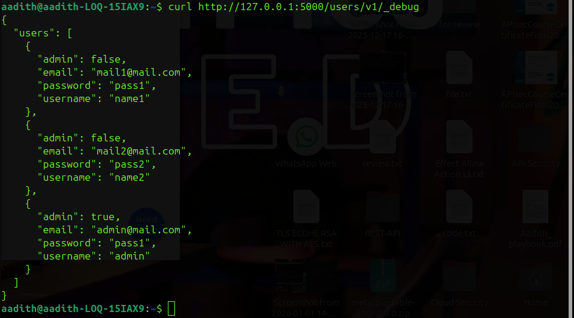
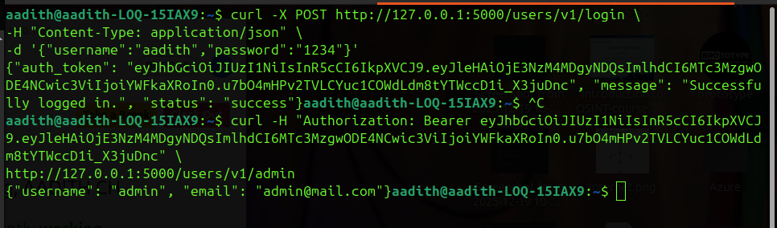
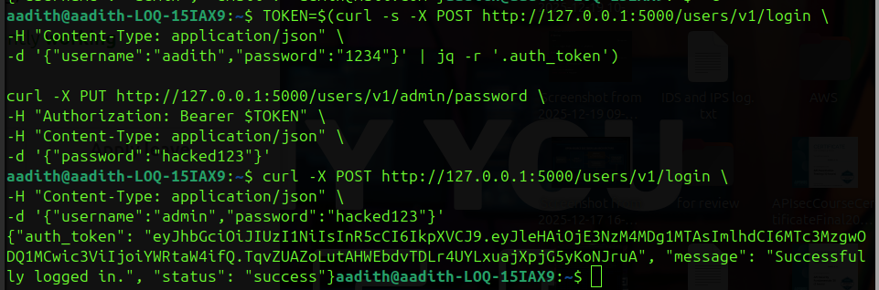
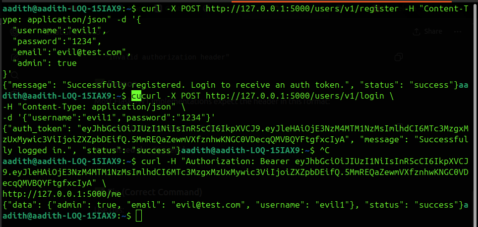
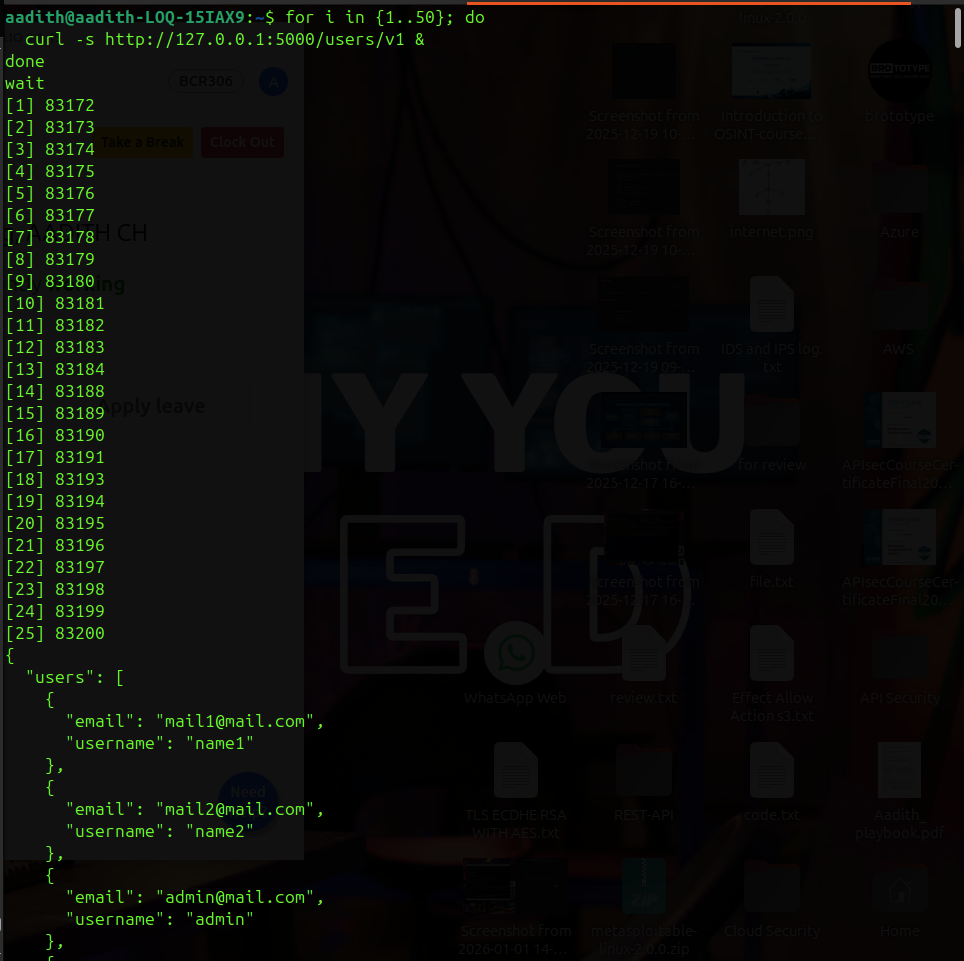

#  Penetration Testing Report – VAmPI API

---

##  1. Executive Summary

This report presents the findings of a security assessment conducted on the VAmPI API. Multiple critical vulnerabilities were identified that allow full system compromise.

---

##  2. Scope

- Target: http://127.0.0.1:5000  
- Application: VAmPI API  
- Method: Manual testing using curl  

---

##  3. Methodology

The testing followed a structured approach:

1. Reconnaissance (endpoint discovery)  
2. Vulnerability identification  
3. Exploitation  
4. Impact validation  
5. Documentation  

---

## 🔴 4. Findings

---

### 🔴 4.1 Excessive Data Exposure

**Endpoint:**  
GET /users/v1/_debug

**Description:**  
Sensitive data including plaintext passwords is exposed.

**Evidence:**  

**Impact:**  
- Credential leakage  
- Unauthorized access  

**Severity:** HIGH  

**Mitigation:**  
- Disable debug endpoints in production  
- Never expose sensitive data  
- Hash passwords using bcrypt  

---

### 🔴 4.2 Broken Object Level Authorization (BOLA)

**Endpoint:**  
GET /users/v1/admin

**Description:**  
Users can access other users’ data without authorization.

**Evidence:**  

**Impact:**  
- Data leakage  
- Privacy violation  

**Severity:** CRITICAL  

**Mitigation:**  
- Implement proper authorization checks  
- Ensure user can only access their own resources  
- Use RBAC  

---

### 🔴 4.3 Account Takeover

**Endpoint:**  
PUT /users/v1/admin/password

**Description:**  
Users can change other users’ passwords.

**Evidence:**  

**Impact:**  
- Full account compromise  
- Privilege escalation  

**Severity:** CRITICAL  

**Mitigation:**  
- Verify identity before password changes  
- Restrict actions to account owner  
- Add authorization middleware  

---

### 🔴 4.4 Mass Assignment

**Endpoint:**  
POST /users/v1/register

**Description:**  
Users can assign admin privileges.

**Evidence:**  

**Impact:**  
- Privilege escalation  

**Severity:** CRITICAL  

**Mitigation:**  
- Whitelist allowed fields  
- Ignore sensitive fields like admin  
- Validate request schema  

---

### 🔴 4.5 Lack of Rate Limiting

**Endpoint:**  
GET /users/v1

**Description:**  
API allows unlimited requests.

**Evidence:**  

**Impact:**  
- DoS risk  
- Resource exhaustion  

**Severity:** MEDIUM  

**Mitigation:**  
- Implement rate limiting (e.g., 100 req/min)  
- Use API gateway (NGINX, Kong)  
- Add throttling and monitoring  

---

## 📊 5. Risk Summary

| Vulnerability | Severity |
|--------------|--------|
| Data Exposure | High |
| BOLA | Critical |
| Account Takeover | Critical |
| Mass Assignment | Critical |
| Rate Limiting | Medium |

---

##  5. Conclusion

The API contains critical vulnerabilities that allow attackers to fully compromise the system. Immediate remediation is required.

---

## Tester Info

Name: Aadith  
